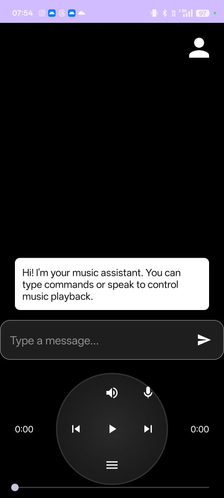

# AI Music Player



## Overview

**AI Music Player** is an advanced Android music player app with integrated AI assistant features. It allows users to play, pause, and manage their music library using both a modern UI and natural language commands. The app leverages Google Gemini AI for chat-based music control and metadata extraction.

## Features

- 🎵 **Music Playback**: Play, pause, skip, and browse songs from device storage.
- 🗣️ **AI Assistant**: Chat with an AI assistant to control playback, search for songs, and get music-related information.
- 🔍 **Automatic Metadata Extraction**: Extracts song metadata using AI and Android's MediaMetadataRetriever.
- 📝 **Chat Interface**: Modern chat UI for interacting with the AI assistant.
- 📂 **Song List**: Browse and select songs from a dynamically loaded list.
- 🔊 **Volume Control**: Adjust playback volume from within the app.
- 👤 **Profile Management**: Set and display a user profile picture.
- 🛡️ **Permission Handling**: Robust handling of storage and media permissions.
- 🖼️ **Screenshot**: See the main UI in `app/src/main/res/drawable/screenshot_main_ui.png`.

## Screenshots


## Getting Started

### Prerequisites
- Android Studio (latest recommended)
- Android device or emulator (API 24+)
- Google Gemini API key (for AI features)

### Setup
1. **Clone the repository:**
   ```sh
   git clone https://github.com/Aditya7594/Ai-Music-Player.git
   cd Ai-Music-Player
   ```
2. **Open in Android Studio** and let Gradle sync.
3. **Add your Gemini API key** in the `AndroidManifest.xml` or `strings.xml` as needed.
4. **Build and run** on your device or emulator.

### Permissions
The app requests permissions for:
- Reading external storage (music files)
- Internet (AI chat)
- Audio recording (voice commands, if enabled)
- Notifications (for playback controls)

## Architecture

- **MainActivity**: Handles UI, permissions, and user interaction.
- **MusicService**: Background service for music playback.
- **GeminiService & AIService**: Integrate with Google Gemini for chat and metadata extraction.
- **MediaController**: Binds UI to the music service.
- **Adapters**: `SongAdapter` and `ChatAdapter` for RecyclerViews.
- **Models**: `Song`, `SongMetadata`, `ChatMessage`.

## Dependencies
- AndroidX, Material Components
- Google Gemini AI SDK
- Glide (image loading)
- CircleImageView

## Contributing
Pull requests are welcome! For major changes, please open an issue first to discuss what you would like to change.

## License
This project is licensed under the MIT License - see the [LICENSE](LICENSE) file for details.

## Credits
- Developed by Aditya Nayak
- Gemini AI by Google
- Open source libraries: Glide, CircleImageView, AndroidX

---

*This README was generated with the help of AI and code analysis.* 